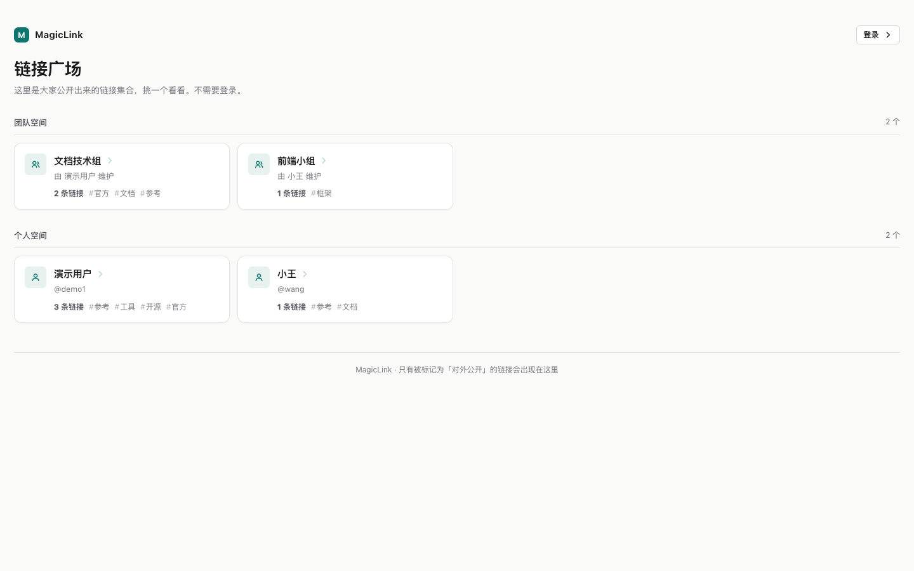
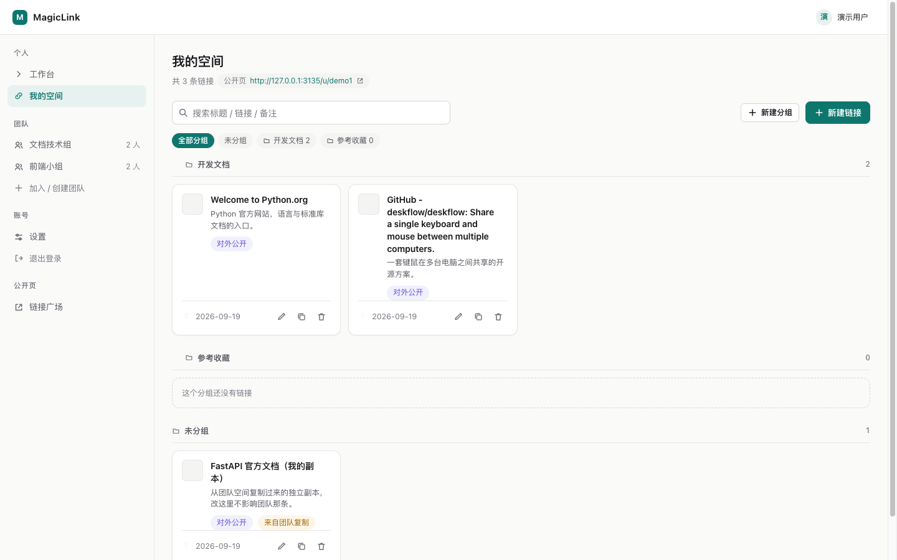
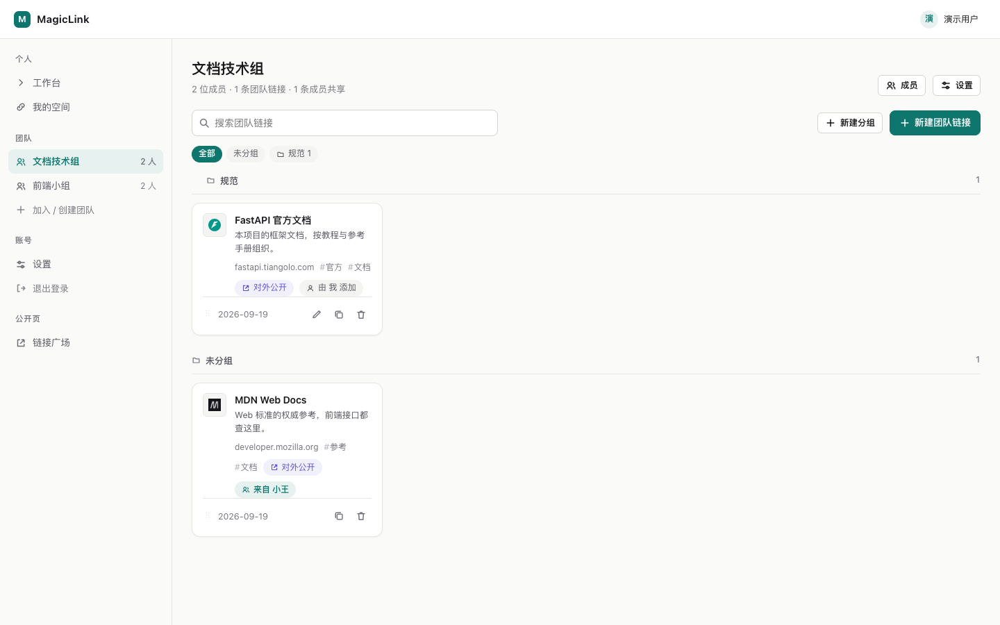
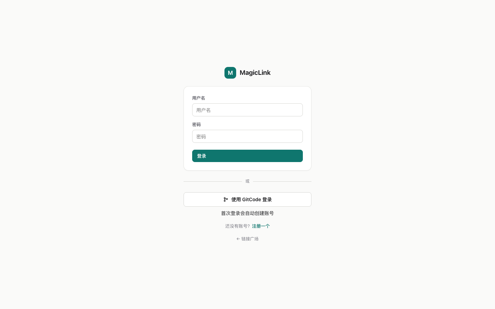
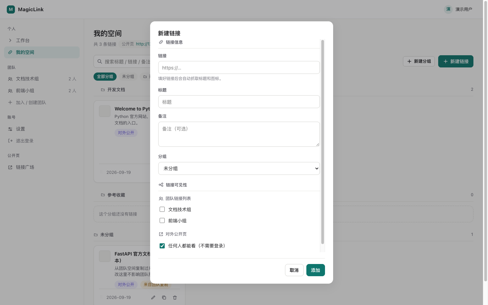
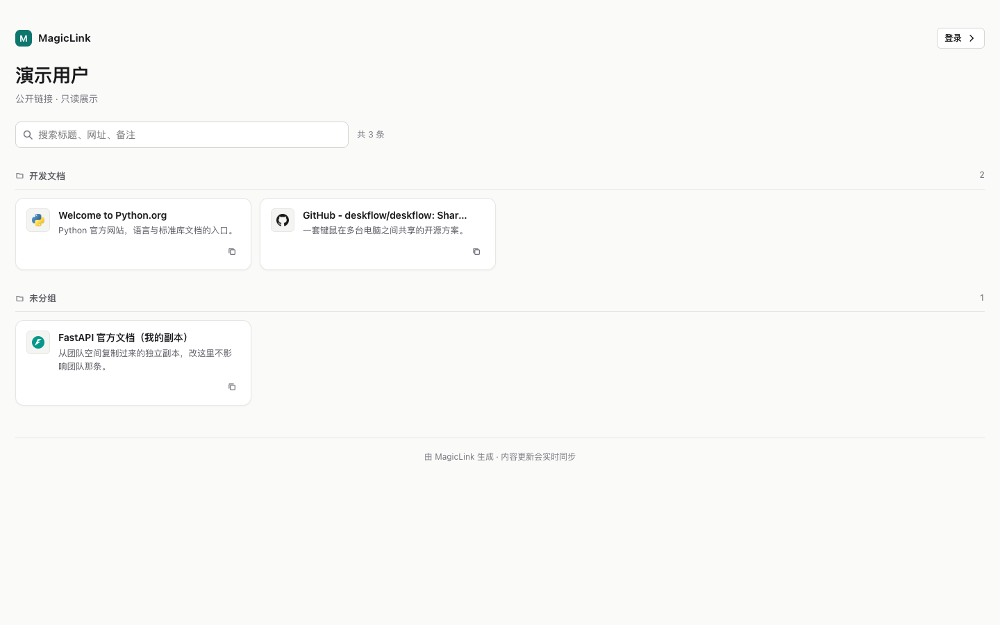
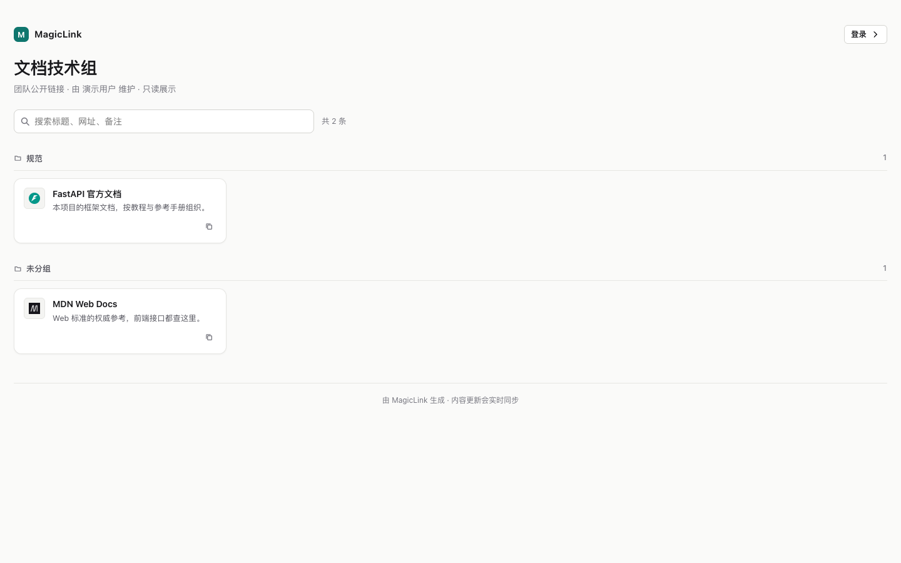

# MagicLink

**自托管的链接管理站点**：每个人的私人收藏 + 团队共享空间，带分组、拖拽排序、权限控制，以及不需要登录就能分享出去的公开页。

FastAPI + SQLite，前端原生 HTML/CSS/ES Module——**零构建、零前端依赖**，一个 SQLite 文件就是全部数据。



|  |  |
| --- | --- |
|  |  |

## 它能做什么

- **个人空间 + 团队空间**：自己的收藏放个人空间；团队另有共享空间，一个人可以属于多个团队。
- **分组归类 + 拖拽排序**：卡片和分组都能拖，顺序实时同步到公开页。
- **两种「放进团队」**：*共享* = 引用同一份（本人改了，团队侧同步变）；*复制* = 独立副本，之后互不影响。
- **可见性 = 这条链接出现在哪些地方**：放进团队链接列表 / 出现在对外公开页——两个勾选互相独立，没有隐含状态。
- **对外公开页**：`/u/<用户名>`、`/t/<团队地址>`，不需要登录、按分组归类、带搜索和标签筛选，默认 `noindex`。
- **权限分两级**：团队拥有者能改、能删任意团队链接；普通成员只能动自己加的。
- **可选 GitCode 登录**：配两个环境变量就启用；用户名 + 密码注册登录是默认方式。
- **自动抓取链接元信息**：标题、描述、favicon。

## 快速开始

需要 **Python 3.10+**（依赖的地板：fastapi / starlette / uvicorn 都是 `>=3.10`）。

> ⚠️ **macOS 自带的 `/usr/bin/python3` 是 3.9，不够用。** 先 `python3 --version` 确认一下。
> 低于 3.10 就装一个新的（或者用 `uv venv`，它会自己挑一个合适的解释器）。

```bash
git clone <仓库地址> MagicLink && cd MagicLink

uv venv .venv                                        # 自动选 3.10+ 的解释器
uv pip install --python .venv/bin/python -r requirements.txt

.venv/bin/python manage.py init                      # 建库（就是一个 SQLite 文件）
./run.sh                                             # 默认 http://127.0.0.1:3030
```

打开 <http://127.0.0.1:3030/app> 注册第一个账号即可开始用。

想先看看它长什么样，可以一键造一套演示数据（**纯本地看效果用**）：

```bash
.venv/bin/python manage.py demo      # 两个账号 demo1 / wang，密码 demo1234
```

它会造出两个团队、两个个人空间、7 条链接（6 条公开 1 条不公开），覆盖分组、标签、共享、复制、两级权限。**README 下面那些截图就是这套数据**。

不用 `uv` 也行——但要自己保证解释器是 3.10+：

```bash
python3.12 -m venv .venv        # 换成本机可用的 3.10+ 解释器
.venv/bin/python -m pip install -r requirements.txt
```

## 配置（全都可以不配）

**开箱即用，一行配置都不需要**：用户名 + 密码登录、直连抓取链接元信息、数据库落在项目根目录的 `magiclink.db`。

要改的话，复制模板再按需填：

```bash
cp .env.example .env
```

`.env` 已被 `.gitignore` 排除（`GITCODE_CLIENT_SECRET` 这类东西绝不进仓库），**`.env.example` 才是提交进仓库的那个模板**。

值得改的几项：

| 变量 | 什么时候需要 |
| --- | --- |
| `GITCODE_CLIENT_ID` / `GITCODE_CLIENT_SECRET` | 想启用 GitCode 登录（两个都填才生效） |
| `MAGICLINK_BASE_URL` | **部署到域名/HTTPS 时必须设**——它决定回调地址和会话 cookie 要不要加 `Secure` |
| `MAGICLINK_DB` | 想把数据库放到代码目录之外 |
| `MAGICLINK_PROXY` | 抓取链接元信息需要走代理 |

完整说明（含每一项的取舍）都写在 `.env.example` 的注释里。

不在 `.env` 里、而是 `run.sh` 参数的：

```bash
PORT=8080 ./run.sh                                # 换端口
```

跑测试（起临时库 + 临时服务，不碰开发库）：

```bash
./tests/run_all.sh
```

## 页面地图

| 路径 | 是什么 | 需要登录 |
| --- | --- | --- |
| `/` | **首页：链接广场**，列出所有开启公开的团队/个人空间，挑一个进去看 | 否 |
| `/app` | 登录、工作台、个人空间、团队空间、设置 | 是 |
| `/u/<用户名>` | 个人对外公开页 | 否 |
| `/t/<团队地址>` | 团队对外公开页 | 否 |

首页刻意不是登录页：访客先看到有哪些公开空间可以逛。右上角会读当前会话——已登录显示**头像 + 昵称**（点了进 `/app`），未登录才显示「登录」按钮。

版式：宽屏（最大 1560px）一行 **4 个卡片**；不足 4 个时卡片仍占 1/4 宽，**不会被拉伸**。窄屏依次降为 3 / 2 / 1 列。

公开页（`/u/`、`/t/`）用的是**同一套网格规则**：同样宽屏、一行 4 个、不足 4 个不拉宽。

`/app` 的个人空间和团队空间也是**同一套网格 + 同样的分组展示**：按分组归类成一块块，每块一行 4 个卡片。区别只有两点——卡片底部多一行（拖拽把手 + 编辑/复制/删除按钮），以及 `/app` 有侧边栏，所以同样视口宽度下卡片会比公开页窄一点（列数一致）。为此空间页用了宽版容器（`.wrap.wide`，上限同样是 1560px），宽屏下两边列数才对得上。

两个网格相关的坑，改动时别踩回去：

- **用固定列数，不用 `auto-fill`**：`auto-fill` 会折叠空轨道，一行只有 1 个卡片时那张卡会被拉伸成整行宽。
- **列宽写 `minmax(0, 1fr)`，不写 `1fr`**：`1fr` 的隐含最小值是 `auto`，内容不换行的长标题会把所在轨道撑宽，同排其他轨道被挤窄，四列就不等宽了（实测会变成 450/343/343/343）。
- 卡片标题的省略号要加在**装文字的那个块**（`> .label`）上。加在 flex 容器上不生效——文字会变成匿名 flex item，`text-overflow` 管不到，结果是硬切掉半个字。

## 分组展示与拖拽排序

个人空间和团队空间都按分组归类展示，并且可以拖拽调顺序：

| 拖什么 | 怎么拖 | 存到哪 |
| --- | --- | --- |
| 卡片 | 按住卡片拖到同组的另一张卡上（落在左/上半边=插到它前面） | `links.position`（团队里成员放进来的链接是 `link_team_links.position`） |
| 分组 | 按住分组标题左侧的把手上下拖 | `groups.position` |

**分组只出现在空间页里，不占侧边栏**。侧边栏「团队」下列的是团队——每个团队是一个独立的顶级空间；分组是空间**内部**的结构（团队空间里也一样是页面内的结构），所以个人空间的分组筛选也放在页面里：搜索框下面一排「全部分组 / 未分组 / 各分组」，点一个只看那一组，再点一次取消。选中某个分组时，页头才出现「重命名分组 / 删除分组」。这跟团队空间完全一致。

**顺序是同步到公开页的**：公开页读的就是同一份 `position`，所以在 `/app` 里拖完，刷新公开页就是新顺序——不需要额外操作。只公开了一部分链接时，公开页按这些链接在原顺序里的相对次序排。

几条设计上的取舍：

- **卡片只能在自己所在的分组里挪**，跨分组拖不放行。换分组请用编辑里的分组下拉——手一滑就把链接挪到别的组，代价比省一次点击大。
- **「未分组」永远排最后**，所以它没有拖拽把手、也不能被拖（它不是数据库里的实体，拖了刷新就会跳回去，不如干脆不给拖）。
- **新加的链接排在该分组末尾**，不会打乱你已经拖好的顺序；换分组时会落到新分组的末尾。
- **拖拽被取消（按 Esc）会还原**，不会留下「看起来改了其实没存」的假象。
- 团队空间里「团队自有链接」和「成员放进来的个人链接」**共用一个顺序号**（两边取最大值 +1），所以新放进来的链接排在末尾，而不是插到别人中间。

## 登录方式



支持两种，可以混用：

| 方式 | 说明 |
| --- | --- |
| **用户名 + 密码** | 注册时自己设。密码用标准库 scrypt 哈希 |
| **GitCode 一键登录** | 在 GitCode 上授权后自动登录；首次登录自动建号 |

GitCode 登录**没配凭据时不显示入口**，接口返回 503，不影响密码登录。

### 配置 GitCode 登录

1. 在 GitCode → 个人设置 → OAuth 应用 里创建一个应用，回调地址填：

   | 场景 | 回调地址 |
   | --- | --- |
   | 本地开发 | `http://127.0.0.1:3030/api/auth/gitcode/callback` |
   | 部署后 | `https://你的域名/api/auth/gitcode/callback` |

2. 把凭据填进项目根目录的 `.env`（这个文件见上面的「配置」一节）：

   ```bash
   cp .env.example .env        # 还没复制过的话
   # 填 GITCODE_CLIENT_ID / GITCODE_CLIENT_SECRET
   ```

3. **重启服务**（配置只在进程启动时读一次）。`./run.sh` 会自动读 `.env`，不需要导出环境变量。

### 账号规则

- **按 GitCode 用户 id 认人**（不是用户名），所以对方在 GitCode 改名不会影响登录。
- 首次 GitCode 登录会建一个**没有密码**的账号，用户名取自 GitCode 的 login；若已被占用则自动加后缀（`hhxi` → `hhxi-2`）。
- **不做邮箱自动归并**：拿 GitCode 登录不会自动并进同名的本地账号（那样谁都能认领别人的账号）。要合并请用「绑定」。
- **绑定/解绑**：登录后在「设置 → GitCode 账号」里绑定。一个 GitCode 账号只能绑一个本地账号，反之亦然。
- 纯 GitCode 账号（没设过密码）**不允许解绑**，否则会把自己锁在门外；先在「设置」里设一个密码即可。
- 绑定失败时回到应用页，用 toast 说明原因（此时是已登录状态，跳登录页会把报错吞掉）。

GitCode 的 OAuth 端点、scope 都可覆盖（私有部署或测试打桩用）：
`GITCODE_AUTHORIZE_URL`、`GITCODE_TOKEN_URL`、`GITCODE_USER_API`、`GITCODE_SCOPE`。

## 核心语义

| 概念 | 含义 |
| --- | --- |
| **共享 = 引用同一份** | 个人链接放进团队列表后，团队看到的就是**同一个链接**。本人在个人空间改了标题，团队侧同步变化。 |
| **复制 = 独立副本** | 从团队空间「复制到我的空间」会新建一条自己的链接，之后互不影响（会标记「来自团队复制」）。 |
| **可见性 = 这条链接出现在哪些地方** | 建链接和改链接用的是同一个弹窗，里面两段：**链接信息**（链接/标题/备注/分组）+ **链接可见性**（放进团队链接列表、出现在对外公开页）。没有单独的可见性弹窗，也没有卡片上的可见性按钮——同一个开关只留一个入口。 |

一条个人链接的可见性就是那两个勾选的组合，**没有隐含状态**：

| 勾选 | 谁能看到 |
| --- | --- |
| 都不勾 | 只有自己 |
| 团队链接列表 | 我勾选的那些团队的成员 |
| 对外公开页 | 任何人（凭网址，不需要登录） |
| 两个都勾 | 上面两处都能看到 |

- 两个勾选**互相独立**：都勾就是"队友和所有人都能看到"。
- 公开页有**空间级总开关**（个人页在「设置」、团队页在「团队设置」）。没开时勾了也不生效——所以弹窗里会直接提示「你的公开页还没开启」并给一个「去开启」按钮，不再静默失败。
- **新建时「对外公开页」默认勾上**（个人链接、团队链接都一样）：建完还得回来勾一次没有意义，不想公开的当场取消即可。只有**新建**这样——编辑已有链接时如实回填它当前的状态，不会被强制勾上。团队链接的表单里还会带上团队公开页的开关状态，免得「默认勾了但其实不生效」。
- **标签没有输入框了**。建/改链接都不再提交这个字段（后端按「没传=不动」处理），所以已有标签不会被抹掉，卡片上的标签和筛选栏照旧；新建的链接没有标签。

### 弹窗里的两段是怎么攒起来的



团队链接的可见性只有一次请求（`public_show` 跟着链接一起提交）。个人链接要两步——团队列表得有 `link_id` 才能写：

1. `POST/PATCH /api/local/links`（`public_show` 顺带一起提交）
2. 再按勾选 `PUT/DELETE /api/local/links/{id}/shares/{team_id}`

所以从团队空间编辑「成员放进来的个人链接」时有个坑：团队链接列表接口**不带 `shares` 字段**。表单发现缺这个字段会补拉一次 `GET /api/local/links/{id}/shares`，否则保存时会把没读到的团队列表记录当成「没勾」而删掉。

### 曾经有过、已下线的中间档

早期还有一档「**对团队可见**」——队友能进你的个人空间页浏览你的链接。**已下线**：对外有公开页了，这个"队友互看收藏"的中间态多余，而且它是让可见性变难理解的主因。

数据库里的 `link_team_links.in_profile` 列保留但不再使用（写入时镜像 `in_space`，避免旧列与事实矛盾）。对应的 `GET /api/teams/{id}/members/{uid}/links` 接口与成员个人空间视图也已移除。

## 对外公开页

|  |  |
| --- | --- |
|  |  |

给链接管理加了一个「对外分享」的出口：把若干条链接勾上「对外公开」，就能得到一个不需要登录的页面。

**两道关卡，缺一不可**（避免误暴露）：

1. **空间级总开关**——在「设置」里开启自己的公开页；团队公开页由**团队拥有者**在「团队设置」里开启。
2. **逐条勾选**——创建/编辑链接时勾「对外公开」，只有勾了的才出现。

**地址可读**：

| 页面 | 地址 |
| --- | --- |
| 首页（空间目录） | `/` |
| 个人公开页 | `/u/<用户名>` |
| 团队公开页 | `/t/<团队地址>`（拥有者自定义，如 `doc-team`；留空则用 `team-<编号>`） |

**首页 = 公开空间目录**：访客进来先看到「团队空间 / 个人空间」两个分区，每个空间一张卡片（名称、维护者、链接数、标签），点进去就是那个空间的公开页。

目录里**只列出至少有 1 条公开链接的空间**——开启了总开关但一条都没勾的空间不出现，免得点进去是空页。

**页面形态**：按分组归类，带搜索框和标签筛选（前端筛选，几百条无压力），只读、卡片式、响应式。
默认带 `noindex`，搜索引擎不会收录。

**顶栏右上角显示当前登录态**（首页、个人公开页、团队公开页都一样）：已登录显示用户名，点了进 `/app`；未登录显示「登录」按钮。公开页本身不加载主应用，这一小块是独立探测会话的——探测失败只影响这一个按钮，不会让页面打不开。

链接条数（`共 N 条`）放在**搜索框右边**——它和搜索/标签筛选是一件事，筛选时会变成「筛选出 X / Y 条」，跟着搜索框走才看得出因果关系。

**团队公开页收录哪些**：团队自有的公开链接 + 成员共享进团队空间且本人勾了公开的个人链接。
没勾公开的一律不出现。

**关掉即消失**：关闭总开关后，即使链接仍勾着公开，对外页整体返回「打不开这个公开页」。

## 权限

团队链接的完整权限矩阵：

|  | 自己的团队链接 | 别人的团队链接 | 自己共享进来的 | 别人共享进来的 |
| --- | --- | --- | --- | --- |
| **拥有者** | 改 ✓ 删 ✓ | 改 ✓ 删 ✓ | 改 ✓\* 移出 ✓ | 改 ✗ 移出 ✓ |
| **普通成员** | 改 ✓ 删 ✓ | 改 ✗ 删 ✗ | 改 ✓\* 移出 ✓ | 改 ✗ 移出 ✗ |
| **非成员** | — 一律 403 — | | | |

\* 共享进来的链接**内容归本人**，得走 `/api/local/links/{id}` 改自己那条；团队接口对这类链接一律 400（详情提示「去个人空间改」）。

- **「团队链接」和「共享进来的个人链接」是两种东西**：前者内容归团队（拥有者能改任何一条），后者内容归本人（连拥有者都改不了，只能移出团队）。
- **移出团队 ≠ 删除链接**：把共享链接移出团队，链接本身还在本人的个人空间里。
- owner 不能退出团队（要先删团队）；删除团队不影响成员的个人链接。
- **接口返回的 `can_edit` / `can_remove` 必须和接口实际结果一致**。这两个标志是前端决定要不要显示按钮的依据，说错了的后果是「按钮点下去 403」或者「明明能操作却没按钮」。`test_team_perms.py` 里每个格子都同时断言「标志的值」和「真去打一次接口的状态码」——历史上就是这里出过错：`_team_items`（与请求者无关）里残留了一段无条件 `can_remove = True`，导致普通成员在别人的链接上也看到删除按钮。
- **卡片上标出「谁加的」**：团队链接显示「由 X 添加」（自己加的显示「由 我 添加」），成员共享进来的显示「来自 X」。创建人退队后名字仍然显示得出来——名字按 `users` 查，不是按当前成员表查。

## 邀请码与加入团队

- 邀请码是 **10 位大写字母+数字**（字符表 `ABCDEFGHJKLMNPQRSTUVWXYZ23456789`，刻意去掉 `0/O`、`1/I` 这些容易看错的）。**大小写不敏感、前后空格无所谓**——用户是手抄或者从聊天里复制的，不该因为大小写被挡在外面。
- **邀请码是团队的唯一凭据**，所以「重新生成」要能让发出去的那串立刻作废（拥有者专属，成员调 403）。释放前会先查一次有没有撞上别的团队——`invite_code` 有 UNIQUE 约束，撞上就是一次没法复现的 500。
- 侧边栏那一条是「加入 / 创建团队」，所以弹窗结构也得对得上：标题「加入或创建团队」，主体是邀请码 + 「加入」，**创建走字段下面的一行文字链**，另外保留一个正经的「取消」。曾经把「创建团队」当成次要按钮摆在「加入」左边——结果既没有取消（位置被占了），标题又只写「加入团队」，和入口名对不上。
- **已经在队里再点一次「加入」**：接口按成功返回（不报错），但会带上 `already_member` 标志，前端据此说「你已经在「X」里了」而不是「已加入「X」」。少了这个标志，界面只能瞎猜，于是对着一个早就在的团队说「已加入」。拥有者点自己团队的邀请码同理，且角色不会被降级成 member。

## 技术栈

- 后端：FastAPI + SQLite（标准库 `sqlite3`，无 ORM）
- 前端：原生 HTML/CSS/ES Module，零构建、零依赖
- 密码：标准库 `hashlib.scrypt`（无第三方加密依赖）
- 抓取链接标题/图标：`httpx`，6 秒超时 + 失败降级为手填
- 依赖只有三个：见 `requirements.txt`（版本已钉死）

```
app/
  main.py           应用入口、lifespan、静态资源挂载
  config.py         运行时配置（环境变量 + 自解析 .env）
  db.py             SQLite 连接（每请求一条）、初始化与幂等补列
  schema.sql        表结构
  security.py       scrypt 口令哈希、会话 token、邀请码
  deps.py           登录态依赖（cookie 会话）
  services.py       序列化、过滤、分页、排序与 position 分配
  routers/
    auth.py         注册 / 登录 / 登出
    me.py           当前用户、改昵称、改密码、公开页总开关
    local.py        个人空间（分组 / 链接 / 可见性 / 拖拽排序）
    teams.py        团队（成员 / 分组 / 链接 / 权限 / 拖拽排序 / 复制）
    meta.py         抓取链接元信息
    public.py       对外公开页的匿名数据接口
    gitcode.py      GitCode OAuth 登录与绑定
web/
  home.html  index.html  public.html  styles.css
  js/ api.js ui.js space.js app.js personal.js team.js public.js home.js
manage.py           运维命令（初始化、列用户、造演示数据、重置密码）
run.sh              本地启动
requirements.txt    依赖（钉死版本）
.env.example        配置模板（.env 不入库，这个入库）
LICENSE             MIT
tests/              测试（跑在临时库上，见下）
docs/               README 用的截图（由 `manage.py demo` 的数据生成）
```

## 接口一览

```
POST   /api/auth/register|login|logout
GET    /api/me                              PATCH /api/me
POST   /api/me/password                     POST  /api/me/public        # {enabled}

GET|POST         /api/local/groups          PATCH|DELETE /api/local/groups/{id}
POST             /api/local/groups/reorder  # {items: [group_id, ...]}   拖拽排序
GET|POST         /api/local/links           PATCH|DELETE /api/local/links/{id}
POST             /api/local/links/reorder   # {group_id, items: [link_id, ...]}  拖拽排序
PUT              /api/local/links/{id}/shares/{team_id}   # {in_space, team_group_id}
POST             /api/meta/fetch            # {url} -> {title, description, favicon}

GET|POST         /api/teams                 POST /api/teams/join  # {invite_code}
GET|PATCH|DELETE /api/teams/{id}
POST             /api/teams/{id}/invite/regenerate
POST             /api/teams/{id}/public     # {enabled, slug}  仅拥有者
GET              /api/teams/{id}/members    DELETE /api/teams/{id}/members/{user_id}
GET|POST         /api/teams/{id}/groups     PATCH|DELETE /api/teams/{id}/groups/{id}
POST             /api/teams/{id}/groups/reorder   # {items: [group_id, ...]}
GET|POST         /api/teams/{id}/links      PATCH|DELETE /api/teams/{id}/links/{id}
POST             /api/teams/{id}/links/reorder    # {group_id, items: [{kind, id}, ...]}
POST             /api/teams/{id}/links/{id}/copy-to-personal

# 对外公开页数据（匿名，不需要登录）
GET              /api/public/directory      # 首页用：所有公开空间
GET              /api/public/u/{username}   # 个人公开页
GET              /api/public/t/{slug}       # 团队公开页
GET              /api/public/check-slug?slug=xxx

# GitCode 登录
GET              /api/auth/gitcode/status              # 前端据此决定是否显示入口
GET              /api/auth/gitcode/start?purpose=login|bind
GET              /api/auth/gitcode/callback             # GitCode 回调
POST             /api/auth/gitcode/unbind
```

## 运维命令

```bash
.venv/bin/python manage.py init                          # 初始化 / 补建表
.venv/bin/python manage.py list-users                    # 列出用户
.venv/bin/python manage.py demo                          # 造一套演示数据（本地看效果）
.venv/bin/python manage.py demo --reset                  # 先清掉旧演示数据再重造
.venv/bin/python manage.py reset-password <用户名>        # 重置密码
```

没有邮件通道，所以「忘记密码」由管理员在服务器上执行：

```bash
.venv/bin/python manage.py reset-password <用户名>        # 交互输入新密码
.venv/bin/python manage.py reset-password <用户名> --password '<新密码>'
```

重置密码会顺带清掉该用户的所有会话（旧登录状态立即失效）。

`demo` 是给本地看效果的，密码写死（默认 `demo1234`，可用 `-p` 改），**别在对外可访问的实例上跑**。

## 测试

```bash
./tests/run_all.sh          # 在临时数据库上跑全部测试，不动开发库
```

- `test_api.py` — 功能与权限边界（个人/团队空间、引用语义、复制、成员管理、改密）
- `test_contract.py` — 接口字段契约（前端按字段名取数，缺字段只会静默显示 undefined）
- `test_public.py` — 对外公开页 + 首页目录（默认不外露、逐条开关、总开关、地址校验、匿名可见、目录收录规则）
- `test_reorder.py` — 拖拽排序（组内/分组/团队两种来源共用一个顺序号、接口权限边界、公开页同步）
- `test_team_perms.py` — 团队链接权限矩阵（拥有者/成员/非成员 × 自己的/别人的/共享的；每格同时断言 `can_edit`/`can_remove` 标志与接口实际状态码一致）
- `test_gitcode.py` — GitCode 登录全链路（本地起假 GitCode，真实跑完授权跳转→回调→换 token→建号/绑定）
- `test_concurrency.py` — 并发回归（FastAPI 把同步端点丢线程池，SQLite 连接跨线程会 500）
- `test_frontend_static.py` — 前端源码静态检查（不起服务直接读 `web/`，见下面「前端两条硬规矩」）

### 前端两条硬规矩

这两条都是踩过坑之后钉下来的，`test_frontend_static.py` 会在源码层面挡住：

**① 不许用原生 `replaceChildren`，要用 `setChildren(el, …)`**

`replaceChildren` 按 WebIDL 规则把每个参数转成节点或字符串，`null` 会变成一个
内容为 `"null"` 的文本节点——页面上就凭空多出一个孤零零的 null。
偏偏它专挑「这个元素该不该渲染」的三元表达式下手，而且两个已知场景**首屏都看不出来**
（首屏走 `h()`，`h()` 会过滤 null），只有刷新列表时才冒出来：

- 公开页的空间**一条标签都没有**时，筛选条 `tagbar` 是 `null` → 公开页顶栏下面多一个 null
- 空间列表**只有一页**时，分页器 `pager()` 返回 `null` → 每次新建/编辑/删除后列表下面多一个 null

`setChildren` 和 `h()` 用同一套规则：`null` / `undefined` / `false` 一律跳过。

**② 每个 `fetch` 都要带 `credentials`**

不带的话会话 cookie 不会发出去，表现为「刚登录完又是未登录」。

## 部署（暂未执行）

按现有服务器习惯：systemd 托管 uvicorn + nginx 反代到子路径，数据库与代码分离存放。
需要时再补 unit 文件和 nginx location。

**HTTPS 相关的两件事**：

- **务必设置 `MAGICLINK_BASE_URL=https://你的域名`**。它有两个作用：一是拼 GitCode 回调地址（反代后面 uvicorn 推断不出对外的协议和域名），二是决定会话 cookie 要不要加 `Secure` 标志——`set_session_cookie()` 按它判断。设了 https 才加 `secure`，否则 cookie 会在用户不小心走到 `http://` 时明文发出去；反过来本地开发不设它，cookie 不加 `secure`，否则浏览器根本不存，登录会表现成「刚登录完又是未登录」。
- 会话 cookie 已经是 `HttpOnly` + `SameSite=lax`；`SameSite=lax` 足够挡住跨站表单型 CSRF，配合「写操作全部要求 `application/json`」（跨站表单发不出这个 Content-Type）两道就够用了。

**数据库位置**：`MAGICLINK_DB` 环境变量可指定路径；生产环境应把库放在代码目录之外，避免部署时的 `git reset --hard` 影响数据。

两点部署时要留意：

- **公开页地址目前按根路径生成**（`/`、`/app`、`/u/...`、`/t/...`）。如果要挂在子路径下（例如 `/tool/magiclink/`），需要同时调整 `app/main.py` 里的路由和前端拼 URL 的地方。
- 公开页和首页**必须匿名可达**，反代时不要给它们加登录校验。

**API 文档默认是公开的**（`/api/docs`、`/api/openapi.json`）。自托管小工具用着方便，但如果不想暴露接口全貌，把 `app/main.py` 里 `FastAPI(...)` 的 `docs_url` / `openapi_url` 改成 `None` 即可。

还有一点值得提前知道：**首页目录会把「哪些团队/个人开了公开页」列出来**。空间级的开关本身就是授权，所以默认行为是列出来；如果哪天不希望某个空间出现在目录里，关掉它的公开页总开关即可（届时它的公开页地址也一并失效）。

## 许可

[MIT](LICENSE)
